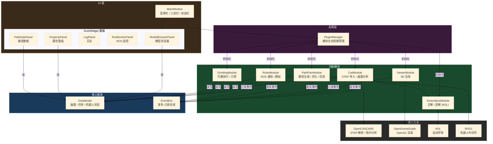
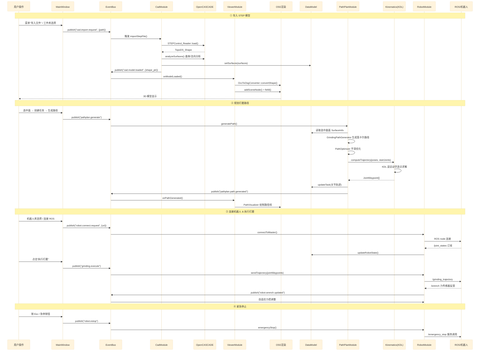

# AIRobot 曲面打磨系统

基于 ROS + OpenCASCADE + OpenSceneGraph 的工业机器人曲面自动打磨系统，提供从 STEP 模型导入、曲面分析、路径规划、运动学解算到机器人执行的完整工作流。

---

## 目录

- [系统架构图](#系统架构图)
- [模块间通信图](#模块间通信图)
- [依赖环境](#依赖环境)
- [构建方法](#构建方法)
- [模块说明](#模块说明)
  - [核心框架](#核心框架-srccore)
  - [应用层](#应用层-srcapp)
  - [功能模块](#功能模块-srcmodules)
  - [UI 面板](#ui-面板-srcuipanels)
- [数据流](#数据流)
- [测试资源库](#测试资源库)

---

## 系统架构图



---

## 模块间通信图



---

## 依赖环境

| 依赖 | 版本要求 | 说明 |
|------|---------|------|
| Qt5 | ≥ 5.12 | Widgets / OpenGL |
| OpenCASCADE | ≥ 7.5 | STEP 解析 / 曲面分析 |
| OpenSceneGraph | ≥ 3.6 | 3D 渲染 |
| KDL (orocos) | ≥ 1.4 | 运动学解算 |
| ROS1 (可选) | Noetic | 机器人通信，无 ROS 自动切换模拟模式 |
| CMake | ≥ 3.16 | 构建系统 |

---

## 构建方法

### macOS

```bash
brew install qt@5 opencascade open-scene-graph

mkdir build && cd build
cmake .. -DQt5_DIR=/opt/homebrew/opt/qt@5/lib/cmake/Qt5
make -j$(nproc)
```

### Windows（推荐 vcpkg + MSVC）

**第一步：安装工具链**

- [Visual Studio 2022](https://visualstudio.microsoft.com/)（勾选"使用 C++ 的桌面开发"）
- [CMake ≥ 3.16](https://cmake.org/download/)
- [vcpkg](https://github.com/microsoft/vcpkg)（C++ 包管理器）

```powershell
# 安装 vcpkg
git clone https://github.com/microsoft/vcpkg.git C:\vcpkg
C:\vcpkg\bootstrap-vcpkg.bat

# 安装所有依赖（x64）
C:\vcpkg\vcpkg install qt5-base:x64-windows
C:\vcpkg\vcpkg install qt5-opengl:x64-windows
C:\vcpkg\vcpkg install opencascade:x64-windows
C:\vcpkg\vcpkg install open-scene-graph:x64-windows
C:\vcpkg\vcpkg install orocos-kdl:x64-windows
```

**第二步：构建**

```powershell
mkdir build && cd build
cmake .. `
  -DCMAKE_TOOLCHAIN_FILE=C:/vcpkg/scripts/buildsystems/vcpkg.cmake `
  -DCMAKE_BUILD_TYPE=Release
cmake --build . --config Release -j
```

> **ROS 说明**：ROS1 官方不支持 Windows。
> Windows 下项目自动进入**模拟模式**（`HAS_ROS` 未定义），可正常使用除实机通信外的所有功能。
> 需要实机控制时，推荐使用 **WSL2 + Ubuntu 20.04 + ROS Noetic**，通过局域网与 Windows 程序通信。

### Linux（Ubuntu 20.04）

```bash
sudo apt install qt5-default libqt5opengl5-dev
sudo apt install libocct-modeling-algorithms-dev libocct-data-exchange-dev
sudo apt install libopenscenegraph-dev liborocos-kdl-dev

# 可选：ROS Noetic
sudo apt install ros-noetic-roscpp ros-noetic-sensor-msgs ros-noetic-geometry-msgs

mkdir build && cd build
cmake ..
make -j$(nproc)
```

---

## 模块说明

### 核心框架 `src/core`

#### `EventBus`
全局发布-订阅消息总线（单例）。各模块通过事件名称通信，避免直接依赖。

| 事件名 | 方向 | 说明 |
|--------|------|------|
| `cad.import.request` | → CadModule | 请求导入 STEP 文件，携带 `path` |
| `cad.model.loaded` | → ViewerModule | 模型加载完成，携带 `shape_ptr` / `faceCount` |
| `cad.face.selected` | → 各模块 | 用户点选了某个面，携带 `faceIndex` |
| `robot.connect.request` | → RobotModule | 请求连接 ROS Master |
| `robot.estop` | → RobotModule | 紧急停止 |
| `robot.send.trajectory` | → RobotModule | 发送关节轨迹 |
| `pathplan.path.generated` | → ViewerModule | 路径生成完成，触发可视化 |
| `log.message` | → LogPanel | 写日志，携带 `level` / `message` |

#### `DataModel`
全局数据模型单例，集中管理所有运行时状态：

- `SurfaceInfo[]` — 所有曲面的类型、面积、曲率、法向
- `GrindingTask[]` — 打磨任务列表（选中面、路径点、关节轨迹、工艺参数）
- `RobotState` — 当前关节角、末端位姿、连接状态

#### `PluginInterface`
`IModule` 抽象接口，所有功能模块继承实现：`initialize()` / `shutdown()` / `toolBarActions()` / `menuActions()`

---

### 应用层 `src/app`

#### `MainWindow`
Qt 主窗口，负责：
- 菜单栏（文件 / 编辑 / 视图 / 工具 / 机器人 / 路径 / **库** / 帮助）
- 工具栏（文件、选择、机器人、打磨）
- DockWidget 布局管理（左侧模型浏览器、右侧属性面板、底部日志）
- **库菜单**：内置机器人库（UR5/UR10/KUKA/ABB/Fanuc）与 STEP 工件库，选中后直接加载测试数据

#### `PluginManager`
模块生命周期管理器（单例）：
- `registerModule()` — 注册模块
- `initializeAll()` — 按依赖顺序初始化
- `module(id)` — 按 ID 查找模块实例

---

### 功能模块 `src/modules`

#### `cad` — CAD 模型模块

| 类 | 职责 |
|----|------|
| `CadModule` | 监听 `cad.import.request`，协调读取、分析、通知 |
| `StepReader` | 调用 OpenCASCADE `STEPControl_Reader` 解析 STEP 文件，提取拓扑结构，做三角剖分（精度 0.1mm）并分析所有曲面属性 |
| `SurfaceAnalyzer` | 在曲面 UV 参数域内均匀采样，计算每点的法向量和曲率（正/高斯），生成等距扫描线（用于打磨行路径）|

支持的曲面类型：平面、圆柱面、圆锥面、球面、环面、Bezier 曲面、B 样条曲面、旋转面、拉伸面、偏置面。

#### `viewer` — 3D 渲染模块

| 类 | 职责 |
|----|------|
| `ViewerModule` | 监听 `cad.model.loaded`，驱动转换与显示 |
| `OsgViewerWidget` | 继承 `QOpenGLWidget`，嵌入 OSG `Viewer`（单线程模式），管理场景图层（模型/机器人/路径/辅助元素） |
| `OccToOsgConverter` | 遍历 OCC 拓扑面，将三角剖分数据转换为 OSG `Geometry`，设置材质/法线/背面剔除 |
| `FacePickHandler` | OSG 拣取事件处理，点击 3D 面后发布 `cad.face.selected` |
| `PathVisualizer` | 将路径点列表渲染为 OSG 线条，叠加在工件模型上 |

#### `kinematics` — 运动学模块

| 类 | 职责 |
|----|------|
| `IKinematics` | 运动学抽象接口：正解 / 逆解 / 批量轨迹计算 / 关节限位检查 |
| `KdlKinematics` | 基于 KDL（Kinematics & Dynamics Library）实现，适用于 macOS/无 ROS 环境 |
| `KinematicsFactory` | 工厂类，根据编译环境自动选择 KDL 或 MoveIt 实现 |
| `RobotConfig` | 机器人 DH 参数、关节限位、工具中心点配置（UR5 / UR10 / 自定义） |

#### `pathplan` — 路径规划模块

| 类 | 职责 |
|----|------|
| `PathPlanModule` | 协调路径生成 → 优化 → 逆解 → 仿真全流程 |
| `GrindingPathGenerator` | 基于曲面等距扫描线生成笛卡尔空间路径点，支持步距 / 进给速度 / 工具法向补偿参数 |
| `PathOptimizer` | 路径平滑、去冗余、关节空间连续性优化 |
| `PathSimulator` | 时序仿真，驱动机器人模型按轨迹运动，发布进度事件 |

#### `robot` — 机器人通信模块

| 类 | 职责 |
|----|------|
| `RobotModule` | 管理连接状态，提供工具栏"连接 / 急停"按钮，无 ROS 时自动启动 20Hz 模拟定时器 |
| `RosBridge` | 独立线程中运行 ROS1 节点；订阅 `/joint_states` / `/wrench`；发布轨迹到 `/grinding_trajectory`；调用 `/emergency_stop` 服务 |

#### `grinding` — 打磨执行模块

负责实际打磨任务的执行流程控制、实时力控反馈处理、打磨质量监控。通过 `RosBridge` 向机器人下发指令，监听力传感器数据进行自适应调整。

---

### UI 面板 `src/ui/panels`

| 面板 | 位置 | 功能 |
|------|------|------|
| `ModelBrowserPanel` | 左侧 Dock | 工件拓扑树（面列表 + 类型标签）、打磨任务列表、坐标系管理 |
| `PropertyPanel` | 右侧 Dock | 显示选中面的详细属性（曲面类型、面积、曲率范围、法向量）及当前任务的打磨参数 |
| `LogPanel` | 底部 Tab | 实时日志，按 INFO / WARNING / ERROR 级别着色 |
| `RosMonitorPanel` | 底部 Tab | 实时显示 ROS 话题数据（关节角、力传感器、连接状态） |
| `PathDataPanel` | 底部 Tab | 路径点列表、各点位置 / 法向 / 进给速度 / 压力数据表格 |

---

## 数据流

```
用户选择 STEP 文件
    │
    ▼
CadModule::importStepFile()
    ├─ StepReader::load()          — OpenCASCADE 解析 STEP
    ├─ 三角剖分（精度 0.1mm）
    ├─ analyzeSurfaces()           — 曲面类型 / 面积 / 曲率分析
    ├─ DataModel::setSurfaces()    — 更新全局曲面数据
    └─ EventBus.publish("cad.model.loaded", shape_ptr)
            │
            ▼
    ViewerModule::onModelLoaded()
        ├─ OccToOsgConverter::convertShape()  — OCC → OSG 网格
        └─ OsgViewerWidget::addSceneNode()    — 加入 3D 场景显示

用户在 ModelBrowserPanel 选中曲面 → 创建打磨任务
    │
    ▼
PathPlanModule::generatePath()
    ├─ GrindingPathGenerator       — 生成笛卡尔路径点
    ├─ PathOptimizer               — 路径平滑优化
    ├─ IKinematics::computeTrajectory() — 逆运动学解算关节轨迹
    ├─ DataModel::updateTask()     — 保存路径和轨迹
    └─ EventBus.publish("pathplan.path.generated")
            │
            ▼
    PathVisualizer                 — 路径可视化叠加显示

用户点击"执行打磨"
    │
    ▼
GrindingModule::executeGrinding()
    └─ RosBridge::sendTrajectory() — 发送关节轨迹到 ROS
            │
            ▼
    机器人执行 ← /grinding_trajectory
    力传感器反馈 → /wrench → GrindingModule 自适应调整
```

---

## 测试资源库

### 机器人库（`库` 菜单 → 机器人库）

| 型号 | 厂商 | 自由度 | 到达范围 | 负载 |
|------|------|--------|---------|------|
| UR5 | Universal Robots | 6 | 850 mm | 5 kg |
| UR10 | Universal Robots | 6 | 1300 mm | 10 kg |
| KR6 R900 | KUKA | 6 | 900 mm | 6 kg |
| IRB 1200 | ABB | 6 | 700 mm | 5 kg |
| M10iA | Fanuc | 6 | 1422 mm | 10 kg |
| CR-7iA | Fanuc | 6 | 717 mm | 7 kg |

选择后立即加载预设关节角到 DataModel，状态栏显示机器人名称。

**KUKA KR600 R2830 三维模型**（`resources/robots/KR600_R2830.stp`，12 MB）可通过"机器人库 → KUKA KR600 R2830 [三维模型]"导入 3D 视图。

### STEP 工件库（`库` 菜单 → STEP 工件库）

存放于 `resources/workpieces/`，来源为 pythonocc-demos 及 STEPcode 官方测试集：

| 文件 | 描述 | 适合测试 |
|------|------|---------|
| `flat_plate.stp` | 多特征机械零件（孔/槽/平面） | 平面打磨路径 |
| `cylinder.stp` | 含圆柱曲面的装配件 | 圆柱面路径规划 |
| `sphere_half.stp` | B 样条笼形曲面 | 样条曲面插值 |
| `turbine_blade.stp` | 通风叶轮（旋转曲面） | 复杂曲面路径 |
| `freeform_surface.stp` | 多面识别测试零件 | 曲面类型识别 |
| `complex_surface.stp` | 大型自由曲面装配体 | 高面数性能测试 |
| `assembly_test.stp` | AP214 标准装配测试件 | 格式兼容性验证 |